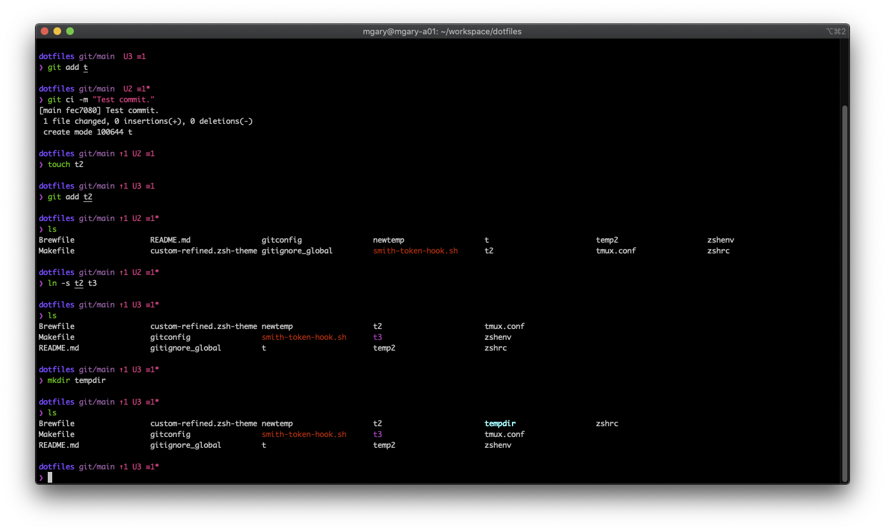

# Mirah's Dotfiles



This exists primarily for the purposes of backing up my config, especially after I lost all my zsh config once in the middle of customizing it.

## Setup

Clone the repo, then run `make setup`
```
git clone git@github.com:MirahImage/dotfiles.git && \
    cd dotfiles && \
    make setup
```

The `keys` target for loading SSH and GPG keys for interacting with GitHub is interactive and fetches secrets from lastpass, so it is not included in the `setup` target.

There are also a number of individual targets:
- `allow-internet` allows executables downloaded from the internet (requires password)
- `brew` installs homebrew and dependencies in the Brewfile (may require password)
- `cf-plugins` installs cf-cli plugins
- `git` configures dotfiles for git and git-mit (requires lastpass login)
- `go-tools` installs golang-specific tooling
- `luan-vim` installs a customized verison of Luan's vimfiles
- `repos` clones git repos (requires `keys`)
- `smith` installs the smith cli tool for interacting with the toolsmiths API and environments (requires `keys`)
- `tmux` configures tmux
- `vscode` installs vscode extensions
- `zsh` installs oh-my-zsh and configures zsh dotfiles
